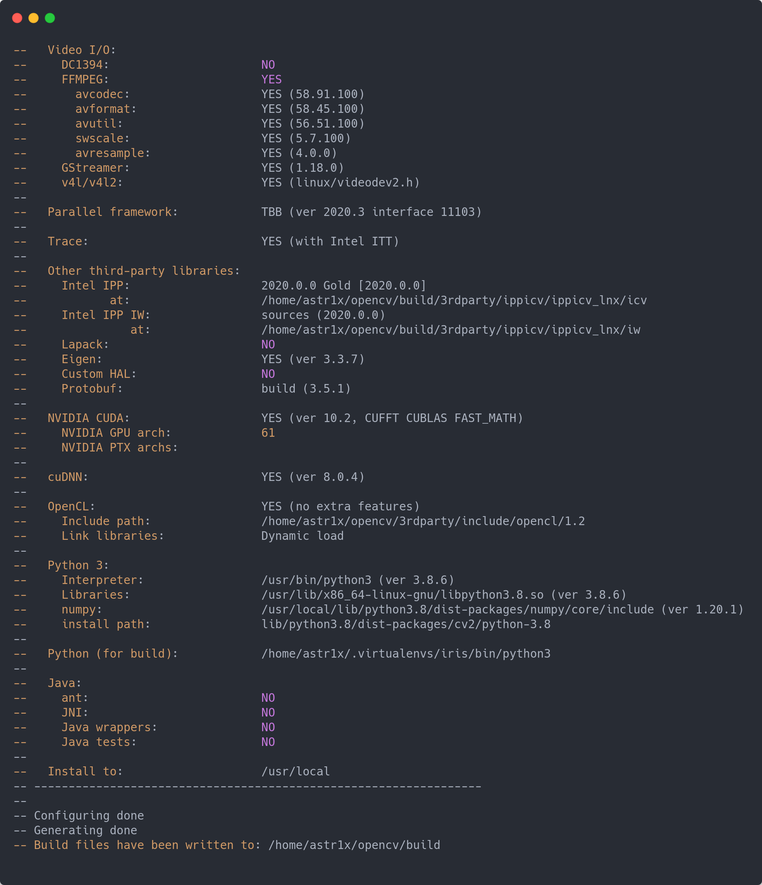

# YOLOv4 OpenCV CUDA DNN

Run YOLOv4 directly with OpenCV using the CUDA enabled DNN module.


## Index

- [YOLOv4 OpenCV CUDA DNN](#yolov4-opencv-cuda-dnn)
  - [Index](#index)
  - [Clone the repository](#clone-the-repository)
  - [Building OpenCV 4.5.1 with CUDA 11.2 and GStreamer](#building-opencv-451-with-cuda-112-and-gstreamer)
  - [Running the code](#running-the-code)
  - [CPU vs. GPU Performance Metrics](#cpu-vs-gpu-performance-metrics)
  - [Citations](#citations)

## Clone the repository

This is a straightforward step, however, if you are new to git or git-lfs, I recommend glancing threw the steps.

First, install git and git-lfs

```sh
sudo apt install git git-lfs
```

Next, clone the repository

```sh
# Using HTTPS
git clone https://github.com/aj-ames/YOLOv4-OpenCV-DNN.git
# Using SSH
git clone git@github.com:aj-ames/YOLOv4-OpenCV-DNN.git
```

Finally, enable lfs and pull the yolo weights

```sh
git lfs install
git lfs pull
```

## Building OpenCV 4.5.1 with CUDA 11.2 and GStreamer

Make sure you have a working build of python3.7/3.8, CUDA and cuDNN. 

To install CUDA and cuDNN, use the following links -

https://developer.nvidia.com/cuda-downloads
https://developer.nvidia.com/rdp/cudnn-download

```sh
sudo apt install python3-dev python3-pip python3-testresources
```

The dependencies needed are the following:

```sh
sudo apt install build-essential cmake pkg-config unzip yasm git checkinstall
sudo apt install libjpeg-dev libpng-dev libtiff-dev
sudo apt install libavcodec-dev libavformat-dev libswscale-dev libavresample-dev
sudo apt install libgstreamer1.0-dev libgstreamer-plugins-base1.0-dev
sudo apt install libxvidcore-dev x264 libx264-dev libfaac-dev libmp3lame-dev libtheora-dev
sudo apt install libfaac-dev libmp3lame-dev libvorbis-dev
sudo apt install libopencore-amrnb-dev libopencore-amrwb-dev
sudo apt-get install libgtk-3-dev
sudo apt-get install libtbb-dev
sudo apt-get install libatlas-base-dev gfortran
sudo apt-get install libprotobuf-dev protobuf-compiler
sudo apt-get install libgoogle-glog-dev libgflags-dev
sudo apt-get install libgphoto2-dev libeigen3-dev libhdf5-dev doxygen
```

Install numpy

```sh
pip3 install numpy
```

Now we move on to the source of OpenCV

```sh
mkdir opencvbuild && cd opencvbuild
wget -O opencv.zip https://github.com/opencv/opencv/archive/4.5.1.zip
wget -O opencv_contrib.zip https://github.com/opencv/opencv_contrib/archive/4.5.1.zip
unzip opencv.zip
unzip opencv_contrib.zip
mv opencv-4.5.1 opencv
mv opencv_contrib-4.5.1 opencv_contrib
```

Once downloaded and extracted, you need to build and install it

```sh
cd opencv
mkdir build && cd build
```

Change the `CUDA_ARCH_BIN` value based on your GPU

```sh
cmake \
-D CMAKE_BUILD_TYPE=RELEASE -D CMAKE_C_COMPILER=/usr/bin/gcc-7 \
-D CMAKE_INSTALL_PREFIX=/usr/local -D INSTALL_PYTHON_EXAMPLES=ON \
-D INSTALL_C_EXAMPLES=ON -D WITH_TBB=ON -D WITH_CUDA=ON -D WITH_CUDNN=ON \
-D OPENCV_DNN_CUDA=ON -D CUDA_ARCH_BIN=7.5 -D BUILD_opencv_cudacodec=OFF \
-D ENABLE_FAST_MATH=1 -D CUDA_FAST_MATH=1 -D WITH_CUBLAS=1 \
-D WITH_V4L=ON -D WITH_QT=OFF -D WITH_OPENGL=ON -D WITH_GSTREAMER=ON \
-D WITH_FFMPEG=ON -D OPENCV_GENERATE_PKGCONFIG=ON \
-D OPENCV_PC_FILE_NAME=opencv4.pc -D OPENCV_ENABLE_NONFREE=ON \
-D OPENCV_EXTRA_MODULES_PATH=../../opencv_contrib/modules \
-D PYTHON_DEFAULT_EXECUTABLE=$(which python3) -D BUILD_EXAMPLES=ON ..
```

Your configuration should look something like this -



Once done, go ahead and complete the build and install

```sh
make -j$(nproc)
sudo make install
```

## Running the code

The code supports a number of command line arguments. Use help to see all supported arguments

```sh
➜ python3 dnn_inference.py --help                   
usage: dnn_inference.py [-h] [--image IMAGE] [--stream STREAM] [--cfg CFG]
                        [--weights WEIGHTS] [--namesfile NAMESFILE]
                        [--input_size INPUT_SIZE] [--use_gpu]

Object Detection using YOLOv4 and OpenCV4

optional arguments:
  -h, --help            show this help message and exit
  --image IMAGE         Path to use images
  --stream STREAM       Path to use video stream
  --cfg CFG             Path to cfg to use
  --weights WEIGHTS     Path to weights to use
  --namesfile NAMESFILE
                        Path to names to use
  --input_size INPUT_SIZE
                        Input size
  --use_gpu             To use NVIDIA GPU or not
```

To pass an image, run the script in the following way:

```sh
python3 dnn_infernece.py --image images/example.jpg --use-gpu
```

To run a stream, run the script this way:

```sh
# Video
python3 dnn_inference.py --stream video.mp4 --use-gpu

# RTSP
python3 dnn_inference.py --stream rtsp://192.168.1.1:554/stream --use-gpu

# Webcam
python3 dnn_inference.py --stream webcam --use-gpu
```

## CPU vs. GPU Performance Metrics

I have tested on two configurations

1. Intel Core i5 7300HQ + NVIDIA GeForce GTX 1050Ti
2. Intel Xeon E5-1650 v4 + NVIDIA Tesla T4

|     Device     |     FPS      |    Device      |     FPS      |
| :------------- | :----------: | :------------- | :----------: |
| Core i5 7300HQ |     2.1      |   GTX 1050 Ti  |     20.1     |
| Xeon E5-1650   |     3.5      |   Tesla T4     |     42.3     |

## Citations

https://github.com/AlexeyAB/darknet
